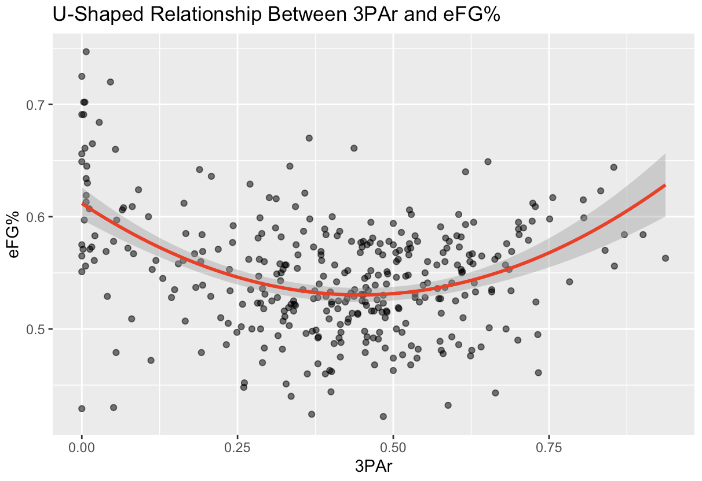
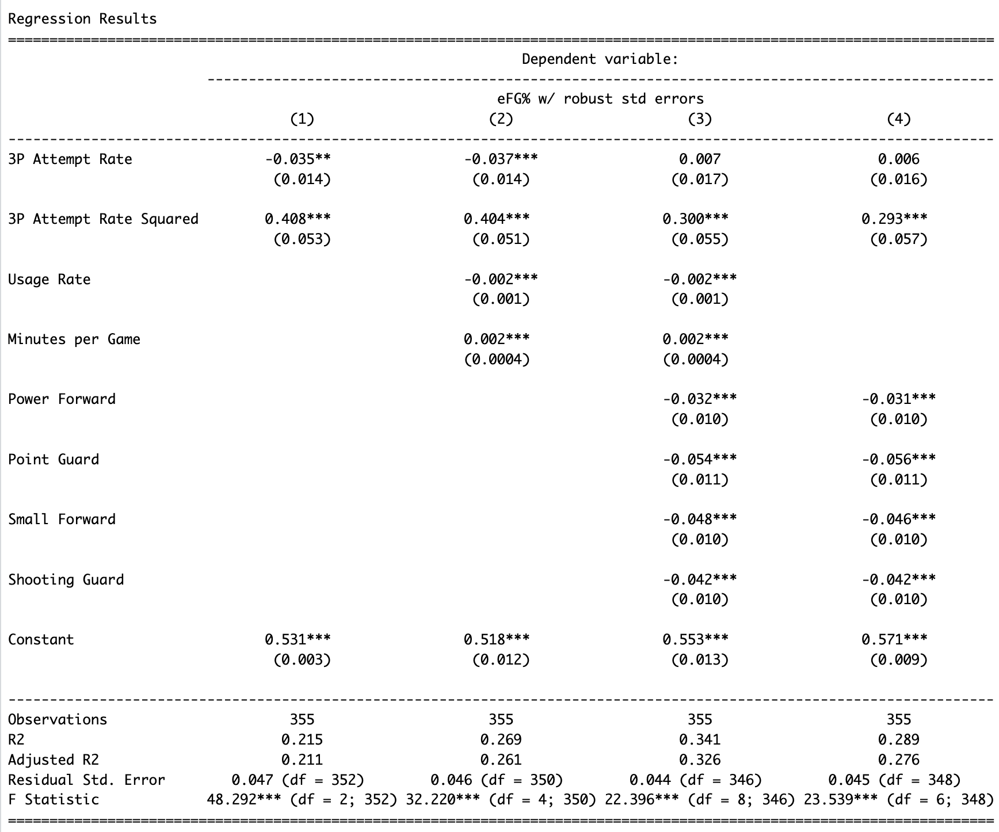

# NBA 3-Point Attempt Rate and Shooting Efficiency Analysis
### Exploring the U-Shaped Relationship Between 3PAr and eFG%
**Author**: William Seward

**Language**: R

**Data Source:** [Basketball Reference (2023–24 season)](https://www.basketball-reference.com)

## Summary
This project examines how NBA players’ three-point attempt rate (3PAr) relates to their shooting efficiency (effective field goal percentage, eFG%) using 2023–24 season data.
Findings indicate a clear U-shaped relationship: both low and high 3-point reliance are associated with higher efficiency, while players with more balanced shot profiles tend to be less efficient.
> Key Insight: Players perform most efficiently when they specialize either as high-volume perimeter shooters or as interior finishers.

---

## Research Question and Motivation

Over the past decade, the NBA has shifted toward perimeter-oriented play, emphasizing spacing, threes, and versatility.
This analysis addresses the question:
> How does a player’s shot selection, as measured by 3-point attempt rate (3PAr), relate to their scoring efficiency (eFG%)?

Understanding this relationship helps quantify whether the modern 3-point revolution truly maximizes player-level efficiency, or whether specialization remains superior to versatility.

---

## Key Findings

- U-Shaped Relationship:
   - Efficiency (eFG%) is highest for players at the extremes of 3-point reliance (very low or very high 3PAr)
   - Efficiency is lowest for players with moderate 3PAr (those taking inside and outside shots without strong specialization).
   - Efficiency bottomsout around ~45% 3PAr.
- Statistical Significance: The quadratic term for 3PAr is positive and significant (p < 0.01) across model specifications.
- Positional Patterns: Guards and forwards show lower average eFG% than centers, even after controlling for usage and minutes per game, consistent with shot location and role differences.
- Model Fit: Best model explains ~33% of variance in efficiency (Adj. R² = 0.326).
- Interpretation: Role specialization (either 3-point specialist or big man) is linked to higher efficiency.

---

## Visuals

### Regression Results (Robust SEs)

---

## Methods

| Step | Description |
|------|--------------|
| **1. Web Scraping** | Used `rvest` to import per-game and advanced stats tables from Basketball Reference |
| **2. Data Cleaning** | Removed duplicates and handled players with multi-team seasons (TOT row), sample includes all players with ≥25 games and ≥12 minutes per game regardless of 3-point volume. |
| **3. Feature Selection** | Focused on variables relevant to shooting efficiency (`eFG%`, `3PAr`, `USG%`, `MPG`, `Pos`) |
| **4. Visualization** | Used `ggplot2` for histograms, scatterplots, and regression diagnostics |
| **5. Regression Modeling** | Used `lm()` with robust SEs (`sandwich` + `lmtest`), formatted output with `stargazer` |

___

## Discussion
The quadratic models suggest diminishing returns around average 3-point attempt rates (~25-65% 3PAr). Efficiency seems to dip when players mix inside and perimeter shots, possibly reflecting role ambiguity.
Players who either limit 3s or maximize 3s tend to optimize their shooting efficiency within today's offensive landscape.

___

## Notes
This is an observational, cross-sectional analysis of player-season averages. Results reflect association, not causation (e.g., endogeneity/reverse causality where efficient shooters may be allowed to take more 3s).
